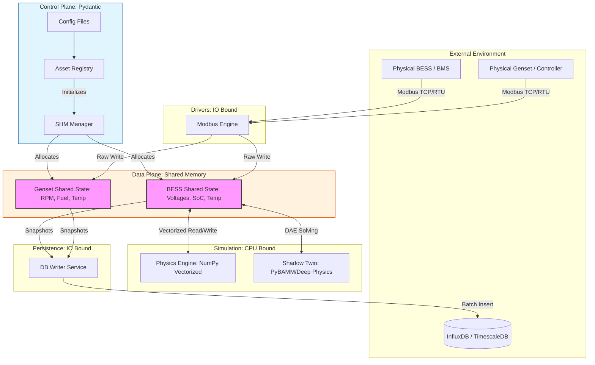

# Technical Specification: High-Performance Microgrid Digital Twin

## Architectural Philosophy: 'Mechanical Sympathy' & Data-Oriented Design (DOD)
### 1. The "Why": Purpose and Goals
Traditional Digital Twins often fail due to Object-Oriented fragmentation. Representing thousands of battery cells as individual Python objects creates massive overhead via pointer chasing and garbage collection, leading to simulations that cannot maintain real-time parity with high-frequency hardware.  

This project employs Mechanical Sympathy by aligning software execution with hardware realities (CPU cache hierarchy and memory alignment). By moving state data into contiguous Shared Memory (SHM) blocks, we achieve:

- **Zero-Copy Inter-Process Communication (IPC):** Telemetry, Physics, and Database workers all access the same physical RAM.
- **Cache Locality:** NumPy-vectorized operations allow the CPU to pre-fetch data, maximizing throughput.
- **Process Isolation:** The "Fast Path" (vectorized math) is never stalled by "Slow Path" tasks (Modbus timeouts or Database writes).

---

### 2. The "How": Structural Blueprints
**Directory Structure**
```plaintext
digital-twin-dod/
├── src/
│   ├── config/            # Pydantic-based Control Plane (Validated Metadata)
│   ├── core/              # The Data Plane (SHM Manager & Asset Registry)
│   ├── drivers/           # Producers (Modbus/CAN Ingestion to SHM)
│   ├── engine/            # Processors (Physics & Shadow Simulation)
│   ├── services/          # Consumers (Database Persistence & API)
│   └── supervisor.py      # System Orchestrator (Lifecycle & Memory Mapping)
├── pyproject.toml         # Dependency Management (Numpy 2.x, Pydantic 2.x)
└── uv.lock                # Deterministic Build Lock
```
**Memory Layout (The Data Plane)**  
Every asset (BESS, Genset, PV) is mapped to a dedicated `SharedState` object. Each attribute (e.g., `voltage`) within that state is a `BESSSingleDataBuffer`, a wrapper around `multiprocessing.shared_memory` and `numpy.ndarray`.

**Crucial Specificatio  n:**

- **Data Types:** Use `float64` for high-precision physics (voltages, current) and `float32` for lower-precision telemetry (temperatures) to optimize cache line utilization.
- **Alignment:** Arrays are strictly 1D and contiguous. Hierarchies (String -> Pack -> Cell) are handled via index slicing rather than nested lists.

### 3. Execution Pipeline
**A. The Control Plane (Initialization)**  
1. **Supervisor** reads the `BESSConfig`.  
2. **SHM Manager** allocates raw byte segments based on `total_cells` (e.g., `num_strings * packs_per_string * cells_per_pack`).  
3. **NumPy Views** are attached to these segments, providing a high-level API for low-level memory.

**B. The Hot Path (Execution)**
1. **Modbus Engine (Producer)**: An `asyncio` loop polls hardware. It performs a direct write into the `SharedState.telemetry` buffer.
2. **Physics Engine (Processor)**: A dedicated CPU-bound process runs a tight loop. It calculates State of Charge (SoC) and Voltage using vectorized NumPy math: `soc_array[:] += (current_in * dt) / capacity`.
3. **DB Writer (Consumer)**: Periodically takes a "snapshot" of the SHM and pushes to a database in batches to avoid blocking the engine.

---

### 4. Implementation Rules for AI Replication
To replicate this project, follow these strict constraints:
1. **No Nested Objects in Loops:** Never iterate over a list of cell objects. Perform operations on the entire NumPy array at once.
2. **Explicit Cleanup:** Every `SharedMemory` block must be explicitly closed and unlinked in `supervisor.py` to prevent OS-level memory leaks.
3. **Avoid Pickling:** Use `multiprocessing.Process` but pass ONLY the `shm_name` (string) and `shape` (tuple) to child processes. Let the children attach to existing SHM by name rather than passing the object itself.
4. **Multi-Fidelity Simulation:** Use the Fast Path (NumPy) for 10Hz-100Hz real-time telemetry and the Deep Path (PyBAMM/Shadow Twin) for infrequent, complex health (SoH) assessments.

---

### 5. Dependency Context
- **Python:** 3.14+ (Required for latest performance optimizations).
- **NumPy:** 2.4.4+ (Vectorized math and memory mapping).
- **Pydantic:** 2.13.1+ (Strict validation for complex topologies).
- **PyBAMM:** 0.32.1+ (Battery physics simulation).

---

### 6. Data Flow Diagram


